# ป้าต้อย (PaaToy) — Business Flow

> อ้างอิง + วิเคราะห์จาก **ป้านวล (PaaNuan)** — https://parnuan.com

---

## 1. User Journey Overview

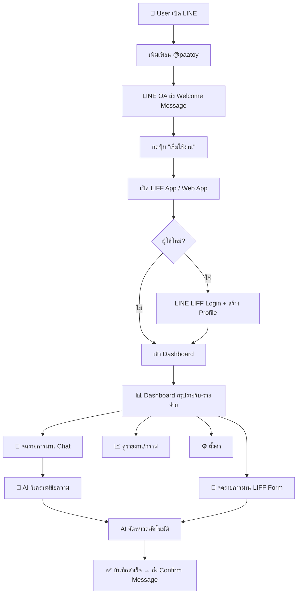

---

## 2. Core Business Flows

### 2.1 🔐 Authentication Flow

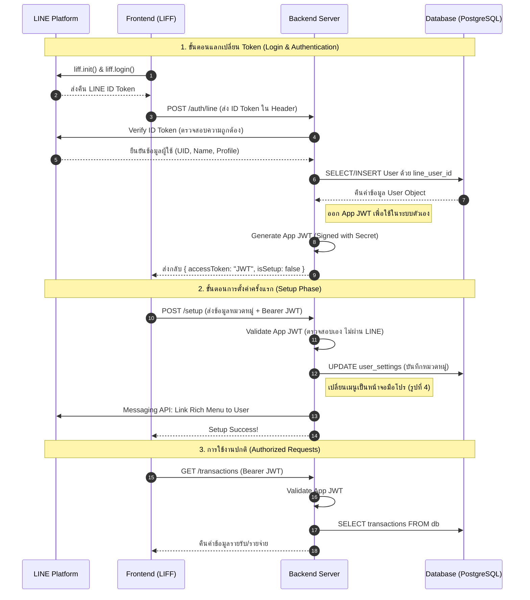

---

### 2.2 💸 Transaction Recording Flow (Core Feature)

มี **2 ช่องทาง** ในการจดบันทึก:

#### ช่องทางที่ 1: จดผ่าน Chat (แบบป้านวล)

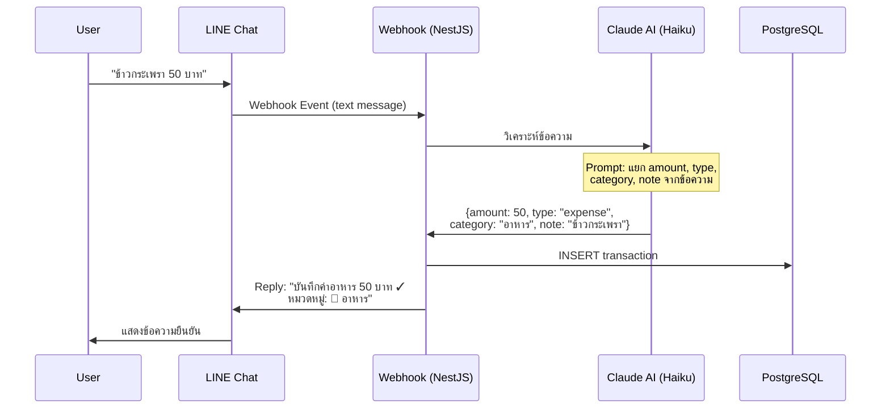

#### ช่องทางที่ 2: จดผ่าน LIFF Web App

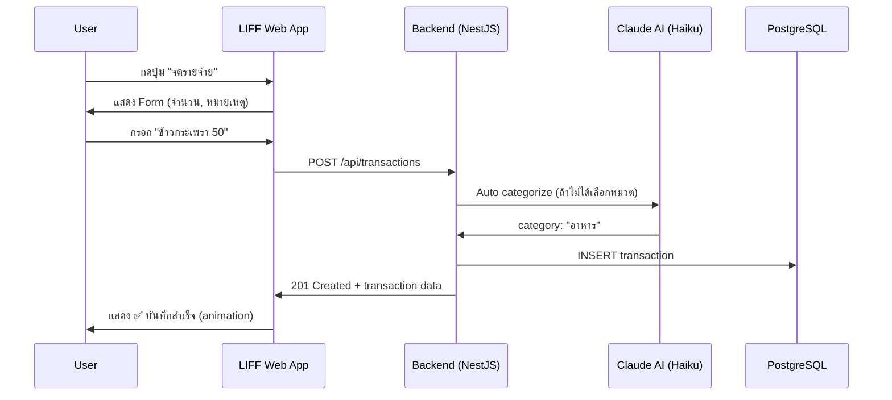

---

### 2.3 📊 Dashboard & Report Flow

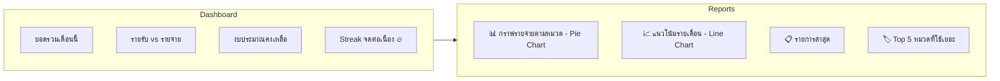

**API Endpoints:**
```
GET /api/transactions/summary?month=2026-04    → ยอดรวมรายเดือน
GET /api/transactions?page=1&limit=20          → รายการทั้งหมด (pagination)
GET /api/transactions/by-category?month=2026-04 → แยกตามหมวดหมู่
GET /api/budgets/status?month=2026-04          → สถานะงบประมาณ
```

---

### 2.4 🏷️ Category Management Flow

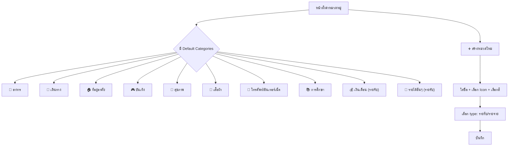

---

### 2.5 💰 Budget Management Flow

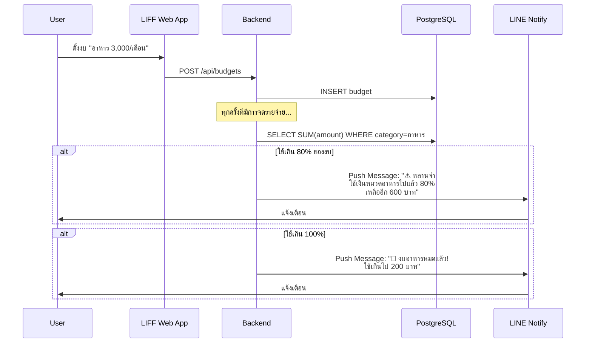

---

### 2.6 🤖 AI Chat Flow (จุดเด่นของป้าต้อย)

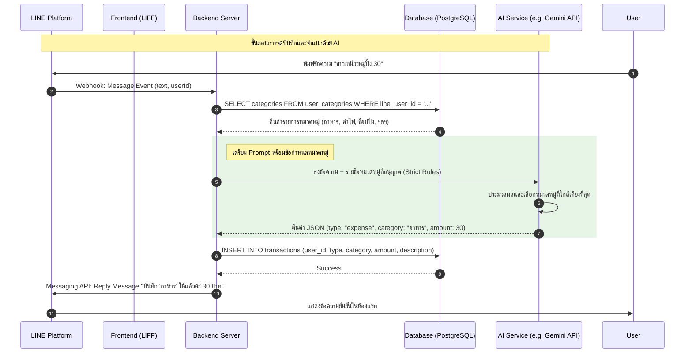

---

### 2.7 📱 LINE Messaging Flow (Webhook)

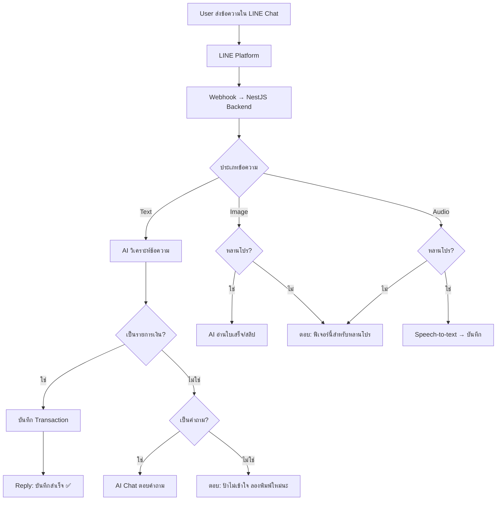

---

## 3. Subscription & Payment Flow

### 3.1 Free vs Premium (หลานโปร) Tiers

| Feature | Free (หลาน) | Premium (หลานโปร) |
|---------|:-----------:|:-----------------:|
| จดด้วยข้อความ | ✅ | ✅ |
| จัดหมวดอัตโนมัติ | ✅ | ✅ |
| ตั้งงบประมาณ | ✅ | ✅ |
| Dashboard สรุป | ✅ | ✅ |
| AI Chat | 5 ครั้ง/วัน | ไม่จำกัด |
| จดด้วยรูป (สลิป/ใบเสร็จ) | ❌ | ✅ |
| จดด้วยเสียง | ❌ | ✅ |
| ส่งออก Excel | ❌ | ✅ |
| ตั้งวันเริ่มงบของเดือน | ❌ | ✅ |
| รายงานสรุปอัตโนมัติ (LINE) | ❌ | ✅ |
| รายการจดประจำอัตโนมัติ | ❌ | ✅ |
| AI Anomaly Detection | ❌ | ✅ |
| AI Smart Budget Suggestion | ❌ | ✅ |
| กราฟวิเคราะห์ขั้นสูง | ❌ | ✅ |
| เตือนจดประจำวัน | ❌ | ✅ |

### 3.2 ราคา (อ้างอิง ป้านวล)

| แผน | ราคา | หมายเหตุ |
|-----|------|----------|
| รายเดือน | 65 บาท | - |
| รายปี | 365 บาท | เฉลี่ยวันละ 1 บาท 🚨 |

### 3.3 Payment Flow (Stripe)

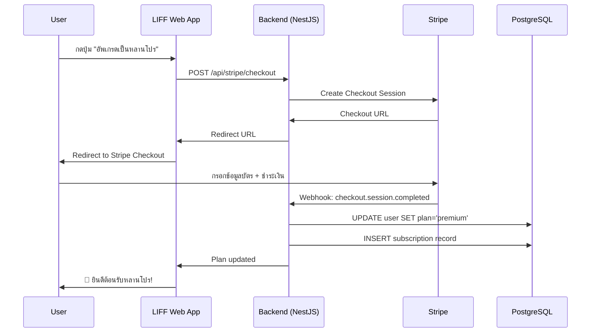

---

## 4. Automated Flows (Cron Jobs)

### 4.1 Monthly AI Summary

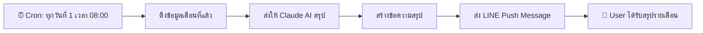

**ตัวอย่างข้อความ:**
```
📊 สรุปเดือน มีนาคม 2569

💰 รายรับ: 30,000 บาท
💸 รายจ่าย: 22,450 บาท
💵 เหลือ: 7,550 บาท

🏷️ Top 3 หมวดที่ใช้เยอะ:
1. 🍔 อาหาร - 8,200 บาท (36%)
2. 🚗 เดินทาง - 4,500 บาท (20%)
3. 🏠 ที่อยู่อาศัย - 3,800 บาท (17%)

💡 ป้าต้อยว่า: เดือนนี้หลานประหยัดกว่าเดือนที่แล้ว 15% เก่งมาก!
```

### 4.2 Anomaly Detection (Weekly)

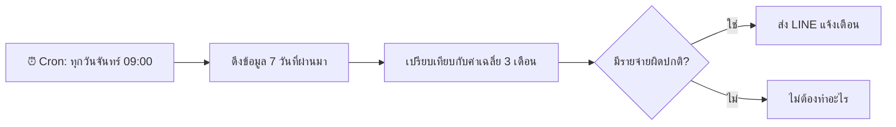

### 4.3 Daily Reminder

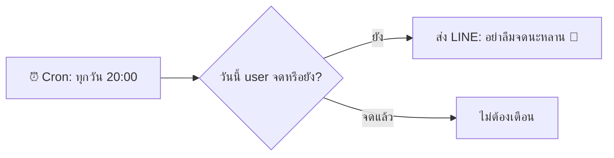

### 4.4 Recurring Transactions

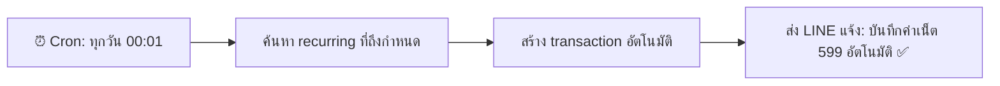

---

## 5. Screen Map (LIFF Web App)

```mermaid
flowchart TD
    subgraph Bottom Navigation
        NAV1[🏠 สรุป]
        NAV2[📋 รายการ]
        NAV3[➕ จดรายการ]
        NAV4[💬 AI Chat]
        NAV5[⚙️ ตั้งค่า]
    end

    NAV1 --> S1[Dashboard]
    S1 --> S1a[ยอดรวมเดือน]
    S1 --> S1b[Pie Chart หมวดหมู่]
    S1 --> S1c[Line Chart แนวโน้ม]
    S1 --> S1d[Streak Counter]

    NAV2 --> S2[Transaction List]
    S2 --> S2a[Filter#colon; วันที่ / หมวด / ประเภท]
    S2 --> S2b[Search]
    S2 --> S2c[แก้ไข / ลบ]

    NAV3 --> S3[Add Transaction Form]
    S3 --> S3a[จำนวนเงิน]
    S3 --> S3b[ประเภท#colon; รายรับ/รายจ่าย]
    S3 --> S3c[หมวดหมู่ หรือพิมพ์ให้ AI เลือก]
    S3 --> S3d[วันที่]
    S3 --> S3e[หมายเหตุ]

    NAV4 --> S4[AI Chat Page]
    S4 --> S4a[Chat Interface]
    S4 --> S4b[คำถามแนะนำ]

    NAV5 --> S5[Settings]
    S5 --> S5a[หมวดหมู่]
    S5 --> S5b[งบประมาณ]
    S5 --> S5c[สกุลเงิน / Timezone]
    S5 --> S5d[ภาษา]
    S5 --> S5e[อัพเกรดหลานโปร]
    S5 --> S5f[รายการจดประจำ Recurring]
```

---

## 6. API Endpoints Summary

### Auth & User
| Method | Endpoint | Description |
|--------|----------|-------------|
| POST | `/api/auth/login` | LINE LIFF Login |
| GET | `/api/users/me` | Get current user |
| PATCH | `/api/users/me` | Fix profile or setting |

### Transactions
| Method | Endpoint | Description |
|--------|----------|-------------|
| GET | `/api/transactions` | List (pagination, filter) |
| POST | `/api/transactions` | Create |
| PATCH | `/api/transactions/:id` | Update |
| DELETE | `/api/transactions/:id` | Delete |
<!-- | GET | `/api/transactions/summary` | Monthly summary |
| GET | `/api/transactions/by-category` | Group by category | -->

### Categories
| Method | Endpoint | Description |
|--------|----------|-------------|
| GET | `/api/categories` | List all |
| POST | `/api/categories` | Create custom |
| PUT | `/api/categories/:id` | Update |
| DELETE | `/api/categories/:id` | Delete |

### Budgets
| Method | Endpoint | Description |
|--------|----------|-------------|
| GET | `/api/budgets` | List all |
| POST | `/api/budgets` | Create |
| PUT | `/api/budgets/:id` | Update |
| DELETE | `/api/budgets/:id` | Delete |
<!-- | GET | `/api/budgets/status` | Check budget usage | -->

### AI
| Method | Endpoint | Description |
|--------|----------|-------------|
| POST | `/api/ai/chat` | AI Chat (Sonnet) |
| GET | `/api/ai/history` | Chat history |

<!-- ### Stripe
| Method | Endpoint | Description |
|--------|----------|-------------|
| POST | `/api/stripe/checkout` | Create checkout session |
| POST | `/api/stripe/webhook` | Handle Stripe events |
| POST | `/api/stripe/portal` | Customer portal | -->

<!-- ### LINE Webhook
| Method | Endpoint | Description |
|--------|----------|-------------|
| POST | `/api/webhook/line` | Receive LINE events | -->

---

## 7. จุดแตกต่างจากป้านวล (Competitive Advantage)

| Feature | ป้านวล | ป้าต้อย (PaaToy) |
|---------|--------|----------------|
| AI Chat คุยกับข้อมูล | ❌ | ✅ Claude Sonnet |
| Anomaly Detection | ❌ | ✅ เตือนเมื่อใช้ผิดปกติ |
| Smart Budget Suggestion | ❌ | ✅ แนะนำงบจาก AI |
| Web App (LIFF) | ✅ Dashboard only | ✅ Full CRUD + AI Chat |
| Open Source | ❌ | ✅ Portfolio project |

---

_Last updated: 2026-04-20_
