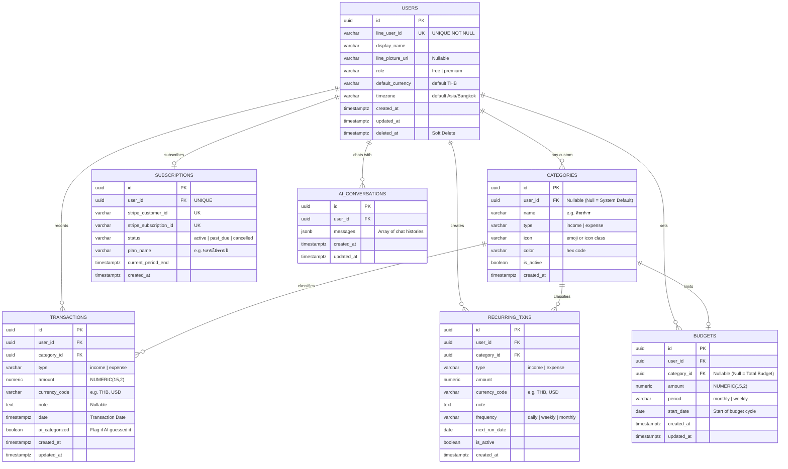

# 🧩 PaaToy CashFlow — System Architecture & Database Schema

เอกสารนี้รวบรวมการออกแบบโครงสร้างของระบบและฐานข้อมูลที่ได้รับการปรับปรุงจาก `BUSINESS_FLOW.md` และ `PLAN.md` เพื่อให้เป็นสถาปัตยกรรมที่พร้อมสำหรับการพัฒนา

---

## 1. System Modules (8 โมดูลหลัก)

เพื่อให้ Backend (NestJS) มีความเป็นระเบียบ (Clean Architecture) และดูแลรักษาง่าย เราแบ่งระบบออกเป็น 8 โมดูลหลัก ดังนี้:

1. **🔐 Auth & User Module:** ตรวจสอบ LINE Login, จัดการ App JWT, จัดการโปรไฟล์และระดับสิทธิ์ผู้ใช้ (Free vs Premium)
2. **💸 Transaction Module:** ระบบหลักจัดการบันทึกรายรับ-รายจ่าย ค้นหา และคำนวณยอดรวม (Aggregation) ส่งให้ Dashboard
3. **🏷️ Category Module:** บริหารหมวดหมู่ ทั้งหมวดหมู่พื้นฐานของระบบ (System Default) และหมวดหมู่ที่ผู้ใช้สร้างเอง
4. **💰 Budget Module:** ระบบตั้งค่างบประมาณและการแจ้งเตือน (Alert) เมื่อใช้เงินถึงเกณฑ์ที่กำหนด (เช่น 80%, 100%)
5. **🤖 AI Processing Module:** จัดการเชื่อมต่อกับ AI API (Claude/Gemini) สำหรับแยกแยะเจตนา (จดบัญชี vs พูดคุย), แยกแยะหมวดหมู่, และเป็น Chatbot 
6. **💬 LINE Integration Module:** คอยรับ Webhook Event จากผู้ใช้ และดูแลการส่ง Reply / Push Message ตลอดจนปรับเปลี่ยน Rich Menu
7. **⏱️ Cron & Automation Module:** จัดการ Job อัตโนมัติเบื้องหลัง เช่น AI สรุปยอดทุกสิ้นเดือน, ตรวจจับพฤติกรรมผิดปกติ, และระบบจดประจำ (Recurring)
8. **💳 Subscription Module:** รองรับการเชื่อมต่อกับ Stripe เพื่ออัปเกรดเป็นระดับพรีเมียม (หลานโปร) 

---

## 2. Entity Relationship Diagram (ERD)

ปรับปรุงจากโครงสร้างเดิมโดยเปลี่ยนมาใช้ `UUID` และเพิ่มตารางสำหรับฟีเจอร์ Subscription, ประวัติแชท AI และการจดรายการอัตโนมัติ

